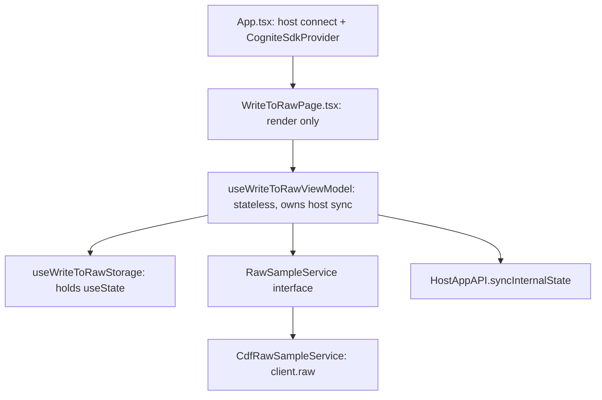

# Implementation plan — hw-write-to-raw

Replace the Flows scaffold splash with a one-click "write five fixed sample rows to CDF RAW" screen, plus a bounded read-back that proves the write landed. Spec: `SPEC.md`. Brief: `App-Brief.md`.

**Status: complete.** All phases below are implemented. Two deviations from the plan as written: the concrete service class is private to its own file behind a `createRawSampleService` factory (standards forbid referencing a concrete class outside its file), and `coverage.include` was set to `src/**/*.{ts,tsx}` so unimported files are still measured. The preview table was also extracted into `SampleRowsTable.tsx` to keep the page small.

## Verified facts this plan depends on

Checked against the installed packages, not from memory.

| Fact | Source |
| --- | --- |
| `insertRows(db, table, items, ensureParent?: boolean)` — positional boolean, **not** `{ ensureParent: true }` | `node_modules/@cognite/sdk/dist/src/api/raw/rawApi.d.ts:63` |
| `RawDBRowInsert` is `{ key: string; columns: Record<string, unknown> }` | `node_modules/@cognite/sdk/dist/src/types.d.ts:1081` |
| `listRows` returns `CursorAndAsyncIterator<RawDBRow>`; resolve via `autoPagingToArray({ limit })` | `node_modules/@cognite/sdk-core/dist/src/types.d.ts:88` |
| Aura 0.3.5 has no `components/table`; `data-grid` lives at `@cognite/aura/data-grid` and needs `@tanstack/react-table` + `@tanstack/react-virtual` | `node_modules/@cognite/aura/package.json` exports map |
| CDF cluster origin is auto-allowed by CSP; leave `permissions.network: []` | `.agents/skills/migrate-app-to-flows/SKILL.md` |

## Phase 0 — Get to a green baseline first

The repo does not currently build clean. Do this before writing any feature code.

1. `npm install` — `node_modules` was absent.
2. Commit the generated `package-lock.json`. CI runs `npm install` with `cache: npm`, and the review bar checks for a lockfile.
3. `src/App.test.tsx:69` asserts `screen.getByText('cog-demo')` while `app.json` now says `cog-bgfast`, so the suite is red (1 failed, 3 passed). This file is rewritten in phase 5 anyway; until then, do not treat "tests pass" as true.
4. Add `src/main.tsx` to `coverage.exclude` in `vitest.config.ts`. It is an entry file, it is untested, and it is an explicitly allowed exclude. Leave every other `src/**` path measured.
5. `src/lib/utils.ts` (`cn`) is measured and untested — it gets covered incidentally once the view uses it, otherwise add a one-case test.

## Architecture



The page calls the ViewModel exactly once at the top of the view tree and passes values down as props, so no `useState` lives in the ViewModel itself and there is no second copy to fall out of sync.

### Files

```
src/writeToRaw/
  sampleData.ts                 constants: database, table, column names, 5 rows
  sampleData.test.ts            keys unique; every row matches the column set
  rawSampleService.ts           RawSampleService interface + CdfRawSampleService
  rawSampleService.test.ts      request args, response parsing, error on failure
  useWriteToRawStorage.ts       useState-backed storage (status, error, rows, panel open)
  useWriteToRawViewModel.ts     context DI, derivations, host sync
  useWriteToRawViewModel.test.ts  loading, success, error, restore-from-initialState
  WriteToRawPage.tsx            Card, preview table, Button, Alert, Loader
  WriteToRawPage.test.tsx       idle, writing, success, error, verification panel
```

### State placement

| State | Where | Why |
| --- | --- | --- |
| Verification panel open | Host-synced | Drives what the user sees; must survive reload and sharing |
| Write status, error text, rows read back | Storage hook | Transient or server-derived |
| Database, table, columns, rows | Module constants | Not state at all (FR-002) |

## Phases

Write the failing test first in each phase. Keep `npm run lint` and `npm test` green at each commit.

### 1. Sample data constants

`sampleData.ts` exports `RAW_DATABASE_NAME`, `RAW_TABLE_NAME`, `SAMPLE_COLUMNS`, and `SAMPLE_ROWS`. Every `updatedAt` is a literal ISO string and every key is a literal — no `Date.now()`, no `crypto.randomUUID()`. That is what makes the write idempotent and the tests deterministic.

### 2. Service

```ts
export interface RawSampleService {
  writeSampleRows(): Promise<number>;
  readSampleRows(limit: number): Promise<SampleRowRead[]>;
}
```

`CdfRawSampleService` takes a narrow structural client type rather than the whole `CogniteClient`, which keeps mocks cast-free:

```ts
type RawClient = {
  raw: {
    insertRows: (db: string, table: string, items: RawDBRowInsert[], ensureParent?: boolean) => Promise<object>;
    listRows: (db: string, table: string, query?: ListRawRows) => { autoPagingToArray: (o?: { limit?: number }) => Promise<RawDBRow[]> };
  };
};
```

`CogniteClient` satisfies this structurally. Tests pass `{ raw: { insertRows: vi.fn(), listRows: vi.fn(() => ({ autoPagingToArray: vi.fn() })) } }` with no `as` cast, which matters because `@typescript-eslint/no-explicit-any` is an error and the standards forbid `as`.

Cover: `insertRows` called with `(RAW_DATABASE_NAME, RAW_TABLE_NAME, SAMPLE_ROWS, true)`; read bounded by `{ limit: 25 }`; rejection propagates as an error.

### 3. Storage hook

`useWriteToRawStorage` owns `useState` for status (`idle` / `writing` / `success` / `error`), error message, rows read back, and panel visibility seeded from `initialState`.

### 4. ViewModel

Context-injected deps (`useWriteToRawStorage`, service factory, host api). Exposes `rowsToWrite`, `status`, `writtenCount`, `errorMessage`, `isPanelOpen`, `rowsFromRaw`, `write()`, `togglePanel()`.

- `write()` sets writing, calls the service, stores the count, then reads back when the panel is open.
- `togglePanel()` updates storage and calls `syncInternalState(JSON.stringify({ resultsOpen }))`.
- On mount with restored `resultsOpen: true`, trigger a read.
- Map CDF 403 to a capability-specific message (`rawAcl:WRITE`), everything else to a generic failure message.

### 5. Page and App wiring

`WriteToRawPage.tsx` renders Card + header, the preview `<table>` (Aura tokens only, `<caption>` or `aria-label` for the accessible name), a primary Button, `Loader` while writing, and `Alert` for success and error. Keep it under 150 lines with no data fetching inside — the review bar flags both.

In `App.tsx`, swap the checklist for `WriteToRawPage`, keep `connectToHostApp`, `CogniteSdkProvider`, and both fallbacks. Build the service from `useCogniteSdk()` at that composition root and inject it.

Rewrite `src/App.test.tsx`: drop the checklist and `cog-demo` assertions, assert the write screen mounts with the fixed database and table.

### 6. Verify

```
npm run lint
npm test
npx vitest run --coverage
npm run build
```

Then manually: click Write in Fusion, confirm five rows in RAW Explorer under `raw_sample_all_flows` / `hello_world`, click Write again and confirm still five rows, open the verification panel, reload and confirm it stays open and re-reads.

## Lint traps that would break a one-shot run

- `react-refresh/only-export-components` is an **error**. Do not export a hook, context, or type alongside a component from the same `.tsx`. Keep contexts and hooks in `.ts` files. (This is why the plan has no `*Provider.tsx`.)
- `import/order` with `newlines-between: 'always'` and alphabetized groups is an **error** — group Node builtins, external packages, then local imports, separated by blank lines.
- `@typescript-eslint/consistent-type-imports` is an **error** — use `import type` for type-only imports.
- `quotes: single` and `noUnusedLocals` / `noUnusedParameters` in `tsconfig.json` are enforced.

## Out of scope

Row editing or deletion, user-supplied values, DMS, Atlas, pagination, mobile layout.

## Suggested commit sequence

1. `fix(test): align deployment assertions with app.json` + `chore: commit lockfile` (phase 0)
2. `feat(raw): add sample row constants and RAW write service`
3. `feat(raw): add write-to-raw view model and screen`
4. `docs: record RAW integration in SPEC.md`
