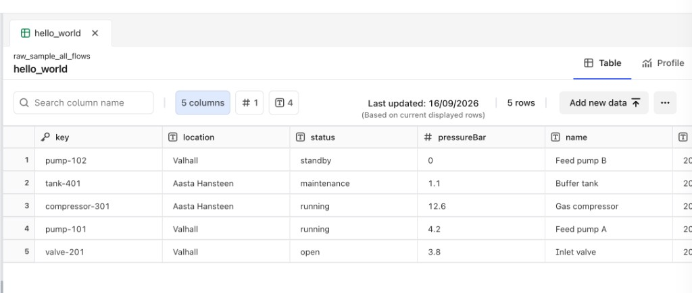

# hw-write-to-raw

Hello-world [Cognite Flows](https://docs.cognite.com/cdf/flows) app that writes a fixed set of sample rows into [CDF RAW](https://docs.cognite.com/20230101/raw/insert-rows-into-a-table) with one click, then reads them back so you can confirm they landed.

It is a working pattern to copy: auth from the Fusion host, `client.raw.insertRows` with `ensureParent`, and a bounded `listRows` read. No forms, no generated keys, no hardcoded cluster URL.

## About

Flows builders often spend a session assembling a RAW write from docs — payload shape, parent database/table creation, and how to prove the row exists. This app replaces that with five sample equipment rows (`pump-101`, `pump-102`, `valve-201`, `compressor-301`, `tank-401`) upserted into:

| | |
| --- | --- |
| Database | `raw_sample_all_flows` |
| Table | `hello_world` |

Keys and `updatedAt` are literals, so writing twice is an upsert: you still get five rows. After a write, **Open in RAW explorer** uses Fusion `navigateInternal` so the link follows whichever org, project, and cluster the app is running in.



The screenshot above is the table after a successful write: five rows, columns `key`, `location`, `status`, `pressureBar`, and `name`.

## Run locally

```bash
npm install
npm run dev
```

The Vite server is HTTPS on port 3001 and opens inside Fusion. You need `rawAcl:WRITE` to insert and `rawAcl:READ` to verify.

```bash
npm test
npm run lint
npm run build
```

## Repo

- App external ID: `write-to-raw`
- Spec: [`SPEC.md`](SPEC.md)
- Implementation notes: [`IMPLEMENTATION.md`](IMPLEMENTATION.md)
- GitHub: [bgfast/hw_cognite_flows_write_to_raw](https://github.com/bgfast/hw_cognite_flows_write_to_raw)
